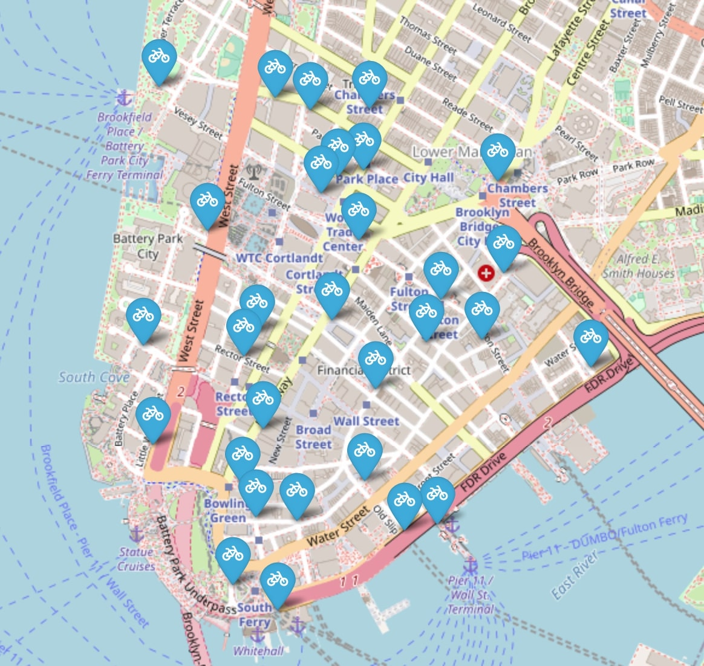

# Citi Bikes ride predictor

The Citi Bikes ride predictor aims to predict the number of rentals at 30 stations in Lower Manhattan.

## Requirements
To run the notebooks you should have jupyter lab or jupyter notebook installed

Create an environment and run `pip install -r requirements.txt`

## Data

### Bike data
The data used in this project is from [Citi Bike NYC](https://citibikenyc.com/system-data).

The data spans from July 2021 to June 2023.

### Weather data
Weather data was obtained from [Open-Meteo](https://open-meteo.com/en/docs/historical-weather-api) with the following settings:
- Location coordinates for NYC (40.7143, -74.006)
- Dates: July 1, 2021 and June 30, 2023
- Hourly weather variables: Temperature, Precipitation, Windspeed(10m) boxs checked
- Units of measurement: Fahrenheit, inches, Mph

The file should be saved as `data/raw/archive2.csv`

## Notebooks
Run the notebooks as follows:
1. Download the files from Citi Bike (link above) into the folder `data/raw`
2. Run `notebooks/cleaning_data.ipynb` (Note: it's not necessary to run the cells from `Getting forecast data` and on)
3. Run `notebooks/data_exploration.ipynb` 
4. Run `notebooks/feature_eng_data_prep.ipynb`
5. (Optional) Run `notebooks/knn_baseline.ipynb`
6. Run `notebooks/knn_no_OHE.ipynb`
7. (Optional) Run `notebooks/rf_baseline.ipynb`
8. Run `notebooks/rf_no_OHE.ipynb`
9. (Optional) Run `notebooks/gb_baseline.ipynb`
10. Run `notebooks/gb_no_OHE.ipynb`

