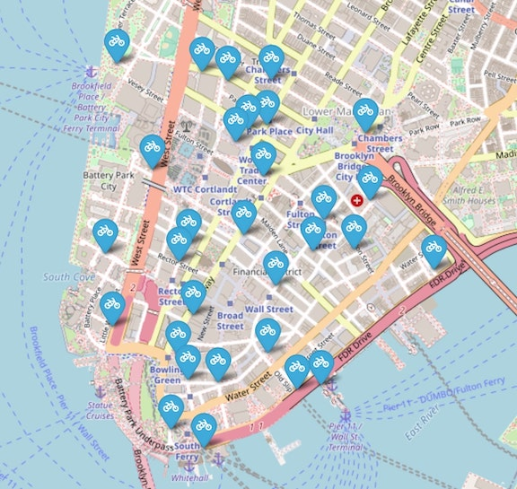

# Citi Bikes ride predictor

In this project I worked with data from Citi Bikes NYC and weather data from Open-Meteo. My goal is to predict the number of hourly rentals at 30 stations in Lower Manhattan. Hourly weather data (temperature, precipitation, wind speed) were added to the trip information. Using the trip start time, the week number, month, weekday, and hour were extracted. The total number of rides were aggregated by the station and hour. To predict the number of rides, three models were tried out: KNN Regression, Random Forest Regression, and Gradient Boosting Regression. Several different representations of the station ids and time features were experiemented with. The best results yieled from casting the station ids as floats (and not grouped into regional categories and OneHotEncoded) and representing the time features cyclically (sine and cosine component for each). The best model was the Random Forest model, with an R2 of 0.88 for the train set and 0.79 for the test set. 

## Requirements
1. To run the notebooks jupyter lab or jupyter notebook should be installed
2. Create and activate an environment. Run `pip install -r requirements.txt`
3. Get bike and weather data (see below)

## Data

### Bike data
The data used in this project is from [Citi Bike NYC](https://citibikenyc.com/system-data). The data spans from July 2021 to June 2023.

### Weather data
Weather data was obtained from [Open-Meteo](https://open-meteo.com/en/docs/historical-weather-api) with the following settings:
- Location coordinates for NYC (40.7143, -74.006)
- Dates: July 1, 2021 and June 30, 2023
- Hourly weather variables: Temperature, Precipitation, Windspeed(10m)
- Units of measurement: fahrenheit, inches, mph

The file should be saved as `data/raw/archive2.csv`

## Notebooks
Run the notebooks in the following order:
1. Download the files from Citi Bike (link above) into the folder `data/raw`
2. Run `notebooks/cleaning_data.ipynb` --> Note: it's not necessary to run the cells from `Getting forecast data` and on)
3. Run `notebooks/data_exploration.ipynb` 
4. Run `notebooks/feature_eng_data_prep.ipynb`
5. (Optional) Run `notebooks/knn_baseline.ipynb`
6. Run `notebooks/knn_no_OHE.ipynb`
7. (Optional) Run `notebooks/rf_baseline.ipynb`
8. Run `notebooks/rf_no_OHE.ipynb` --> Warning: running GridSearchCV in this notebook takes a significant amount of time.
9. (Optional) Run `notebooks/gb_baseline.ipynb`
10. Run `notebooks/gb_no_OHE.ipynb`

